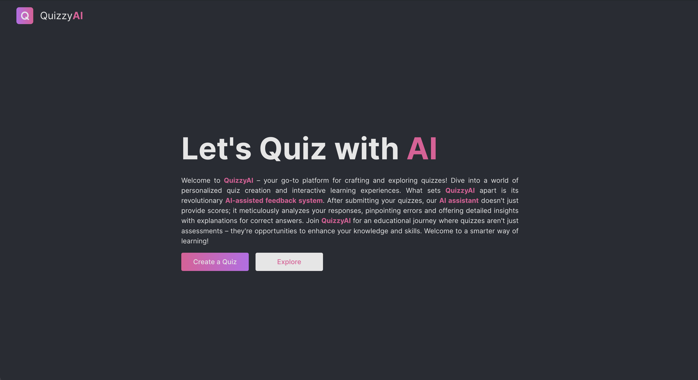
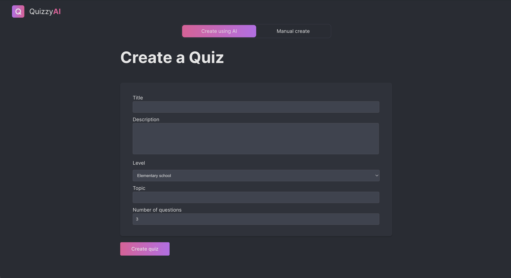
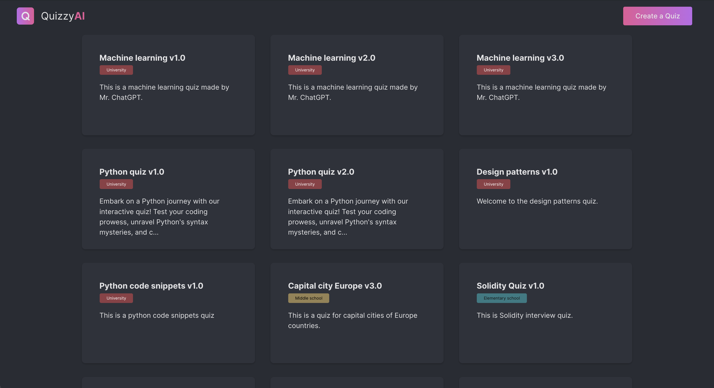

# Quizzy AI

### Description
This project was developed as part of a Master's program in Computer Science. The goal of the project is to leverage the OpenAI API and prompt generation to enable users to create quizzes based on a specific topic and difficulty level. When a user takes a quiz, they receive a score and the option to create a supplementary quiz targeting the questions they answered incorrectly. This feature is designed to encourage users to focus on areas where they need more practice and to enhance their learning experience.

### App Screenshots

### Code
There are two main components to this project: the backend and the frontend. The backend is responsible for interfacing with the OpenAI API and generating prompts based on user input. The frontend is responsible for displaying the prompts to the user and collecting their responses. The backend is written in Node.js and the frontend is written in React.

More information about the project can be found in the README files for the backend and frontend components.